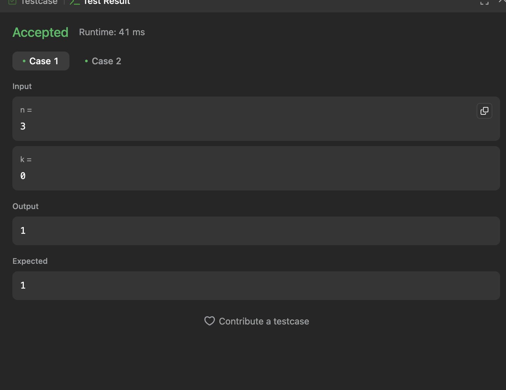
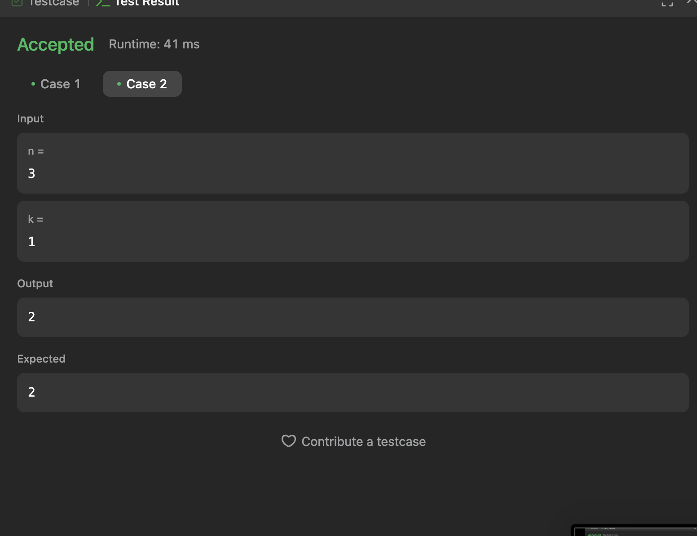

# Execícios do Leetcode

**Número da Lista**: 4<br>

**Conteúdo da Disciplina**: Dividir e Conquistar<br>

## Alunos

- Dupla 6

| Matrícula | Aluno                             |
| --------- | --------------------------------- |
| 211061832 | Harleny Angéllica Araújo de Sousa |
| 211061331 | Alana Gabriele Amorim Silva       |

## Sobre

Este projeto tem como objetivo resolver questões do [LeetCode](https://leetcode.com/problemset/?search=graph&page=1&sorting=W3t9XQ%3D%3D) sobre dividir e conquistar utilizando a linguagem de programação Python. Abaixo, estão listadas as questões selecionadas, com seus respectivos níveis de dificuldade e vídeos explicativos da resolução.

## Questões

| Nome                                                                                                                                    | Nível   |
| --------------------------------------------------------------------------------------------------------------------------------------- | ------- |
| [23. Merge k Sorted Lists](https://leetcode.com/problems/merge-k-sorted-lists/description/)                                             | Difícil |
| [1985. Find the Kth Largest Integer in the Array](https://leetcode.com/problems/find-the-kth-largest-integer-in-the-array/description/) | Média   |
| [629. K Inverse Pairs Array](https://leetcode.com/problems/k-inverse-pairs-array/description/)                                          | Difícil |
| [4. Median of Two Sorted Arrays](https://leetcode.com/problems/median-of-two-sorted-arrays/)                                            | Difícil |
| [1649. Create Sorted Array through Instructions](https://leetcode.com/problems/create-sorted-array-through-instructions/description/)   | Difícil |

## Vídeo

Em andamento.

## Screenshots

### [23. Merge k Sorted Lists](https://leetcode.com/problems/merge-k-sorted-lists/description/)

**Caso 1:**

<br>

**Caso 2:**

<br>

**Caso 3:**

<br>

### [1985. Find the Kth Largest Integer in the Array](https://leetcode.com/problems/find-the-kth-largest-integer-in-the-array/description/)

**Caso 1:**

<br>

**Caso 2:**

<br>

**Caso 3:**

<br>

<<<<<<< HEAD

### [629. K Inverse Pairs Array](https://leetcode.com/problems/k-inverse-pairs-array/description/)

**Caso 1:**

<br>

**Caso 2:**

# <br>

### <br>

**Caso 1:**

<br>

**Caso 2:**

<br>

### <br>

**Caso 1:**

<br>

**Caso 2:**

<br>

> > > > > > > 0ffb5189008cc832c0c428c97d52bd5396e13218

## Instalação

**Linguagem**: Python3 <br>

- Necessário ter o Python instalado.

## Uso

```

python3 "nome-do-arquivo"

```

## Outros

Quaisquer outras informações sobre seu projeto podem ser descritas abaixo.
